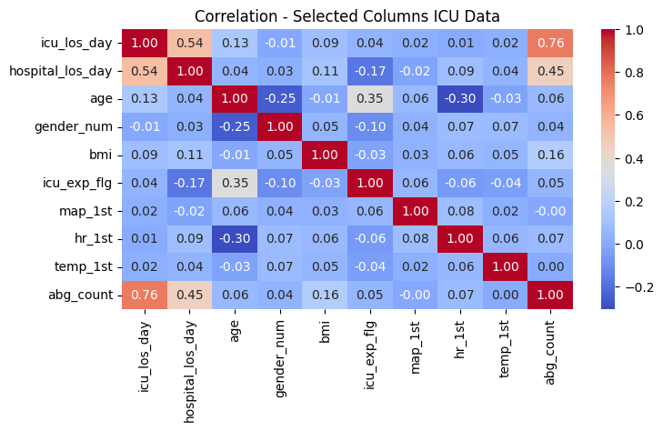
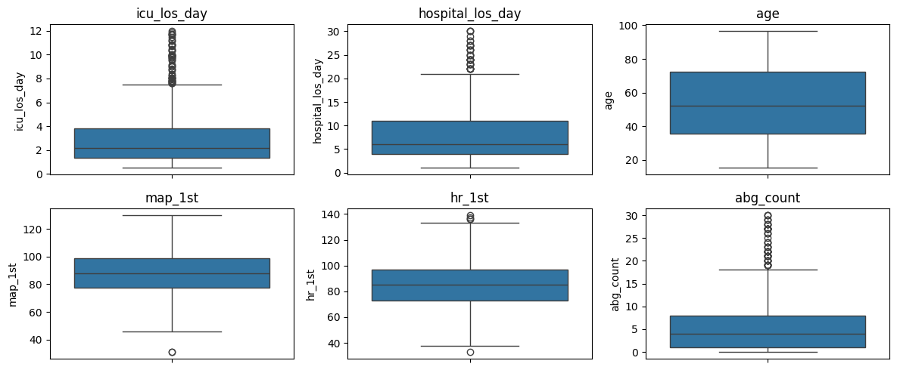
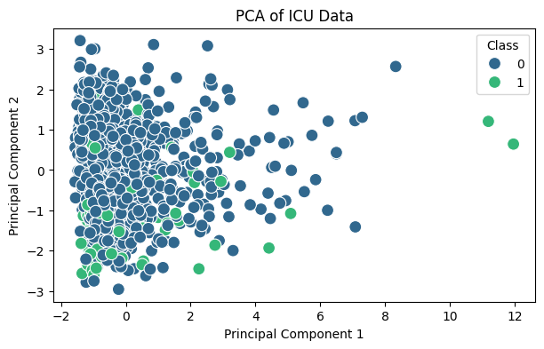
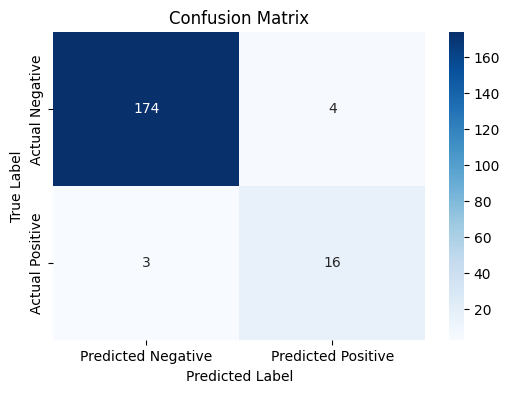

# MIMIC-II ICU Statistical Analysis

## Project Overview

This project explores healthcare and ICU patient data from the MIMIC-II dataset using statistical analysis, data visualization and machine learning preprocessing techniques.

The analysis focuses on identifying patterns, correlations and potential indicators related to ICU mortality and patient characteristics.

This project was developed as part of a Statistics for Data Analytics academic project using Python and healthcare data.

---

## Objectives

- Explore ICU patient data through statistical analysis
- Identify correlations between healthcare variables
- Analyze feature distributions and outliers
- Prepare data for machine learning workflows
- Evaluate model performance using classification metrics
- Apply dimensionality reduction techniques (PCA)

---

## Tools & Libraries

- Python
- Pandas
- NumPy
- SciPy
- Scikit-learn
- Matplotlib
- Seaborn
- Jupyter Notebook

---

## Dataset

The project uses the:

### MIMIC-II Surgical Intensive Care Unit Dataset

The dataset contains healthcare-related information such as:

- ICU mortality indicators
- Patient demographics
- ICU stay information
- Clinical measurements
- Hospital admission details
- Service unit information

---

## Analytical Workflow

The project includes:

- Data cleaning and preprocessing
- Missing data handling
- One-hot encoding for categorical variables
- Correlation analysis
- Statistical visualizations
- Principal Component Analysis (PCA)
- Machine learning preparation workflow
- Classification model evaluation

---

## Visualizations

### Correlation Heatmap



---

### Statistical Boxplots



---

### PCA Visualization



---

### Confusion Matrix



## Key Insights

- Correlation analysis helped identify relationships between ICU variables.
- PCA visualization provided dimensionality reduction insights and feature distribution patterns.
- Statistical boxplots highlighted potential outliers and distribution differences.
- Classification evaluation metrics demonstrated model performance for ICU mortality prediction workflows.

---

## Repository Structure

```text
mimic-ii-statistical-analysis/
│
├── notebooks/
├── data/
├── images/
├── src/
├── requirements.txt
└── README.md
